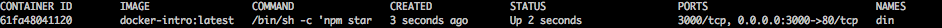

# docker-introduction

- *Date: july 2015*
- *Docker version: 1.0.1*
- *Test on : Ubuntu 14.04(virtualbox VM)*

### Description

Learn Docker in 5 minutes with a small introduction on a nodejs app.

### Getting start

- Install [docker](https://docs.docker.com/installation/) (or [boot2docker](http://boot2docker.io/) if you are an OSX user)
- Clone the project ```git clone https://github.com/olivierodo/docker-introduction.git && cd docker-introduction```
- Take a look to the [Dockerfile](DockerFile)

#### Build the container:

```sh
docker build -t docker-intro .
```

**Be careful : everytime you update the [Dockerfile](Dockerfile) you have to build your container**

##### Run the container:

```sh
docker run -d -p 80:3000 -v $(pwd):/usr/src --name din docker-intro
```

- ``` -d ``` detach the container
- ``` -p 80:3000 ``` Do a port forwarding from the container's port (3000) to the host's port (80)
- ``` -v $(pwd):/usr/src ``` Mpunt the current path ( $(pwd) ) to the workdir inside the container (/usr/src)
- ``` -name din``` Call the container **din**
- ``` docker-intro``` Docker image to use

Now you have just need to connect to the adresse  :
```
http://127.0.0.1
```

If you try from a virtual machine or boot2docker, you should connect to :
```
http://[IP VM/BOOT2DOCKER]
```

You should see the nice message **Hello world**


If you want to restart the container you may have this error:

```sh
YYYY/mm/dd HH:ii:ss Error response from daemon: Conflict, The name din is already assigned to {CONTAINER_ID}. You have to delete (or rename) that container to be able to assign din to a container again.
```

**If you don't modify the [Dockerfile](Dockerfile) it's not necessary to build your container before running it**

#### Verification

To see if you the container is running run :

```sh
docker ps -a
```

You should see :



#### If something wrong

If you want to know what's wrong with your container just run :


```sh
docker run -it -p 80:3000 -v $(pwd):/usr/src --name din docker-intro bash
```
We use the option ```-it``` and decide to override the CMD command from the Dockerfile (nmp start) by ```bash```
This way you will acces by ssh on your container as a root user.
